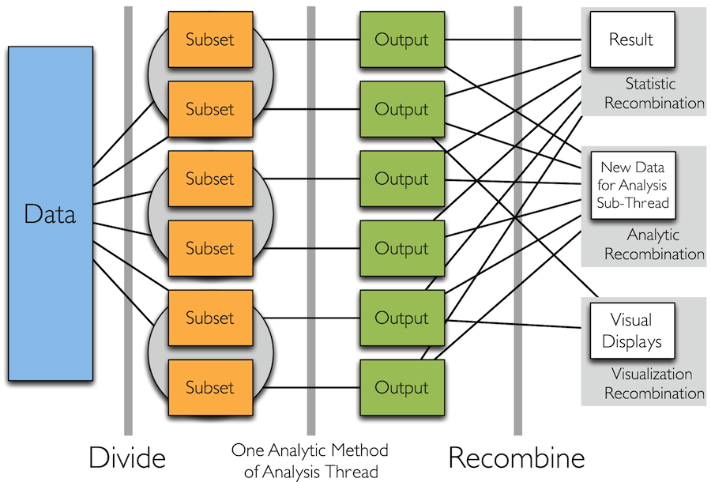
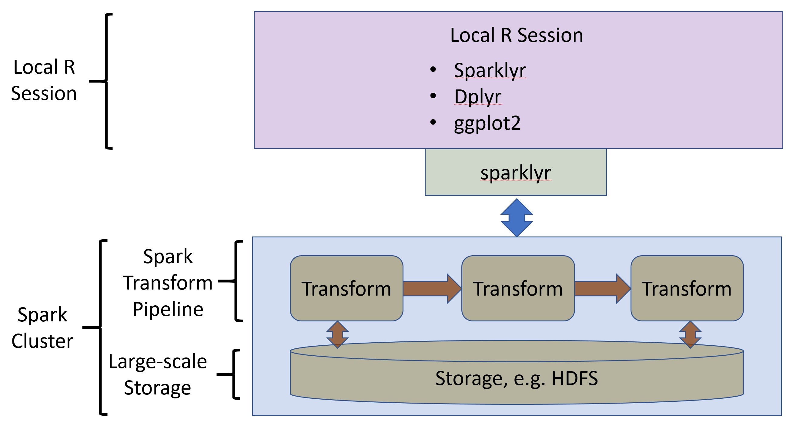
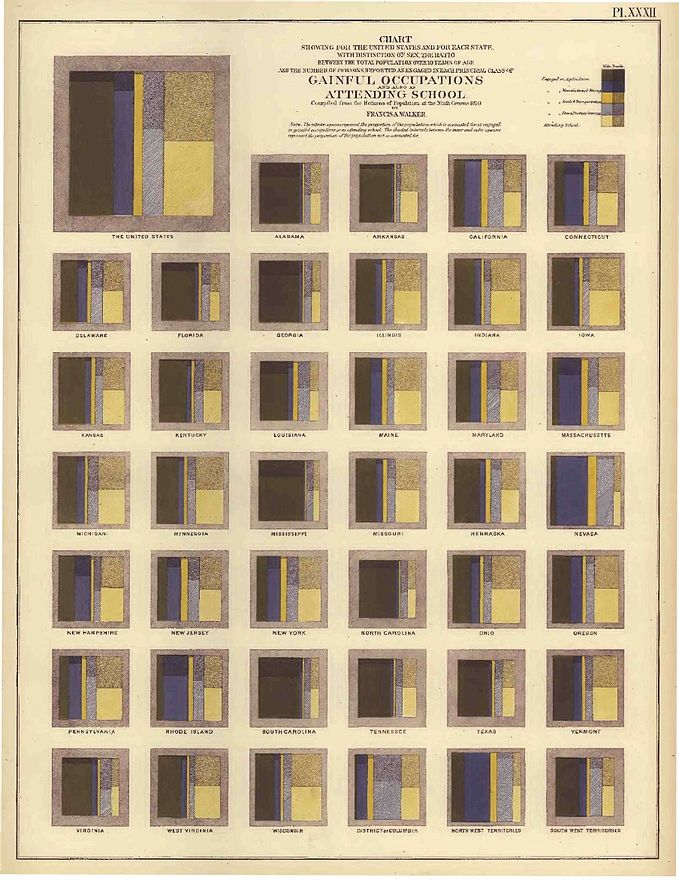
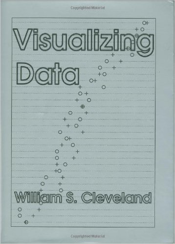

## Installation directions

Before you can run the code in this notebook you should follow the directions from the [README](https://github.com/hafen/strata2017).

## Overview

In this tutorial we will explore methods for exploration and visualization of large complex datasets using R and Spark. We will cover the following topics:

- Developing skills for exploring data in an iterative fashion. Since it is impossible to predict which views and summaries of a new dataset are the most interesting, an iterative process is required. Therefore, it is important to create and understand multiple views of your data.
- Using the divide and recombine methodology on data to compute summary statistics or prepare for visualization.
- Working with Spark as a scalable back-end for divide and recombine.
- Plotting complex data, especially using the the  method of small multiples or conditioning.

This tutorial is mainly about visualization, ranging from summaries to more detailed views of the data. A major component of creating visualizations -- large or small -- from big data is that there is a lot of data manipulation involved. Consequently, a good deal of the tutorial is spent illustrating how to perform a wide variety of operations on data to get it into shape for visualization.

## Introduction to divide and recombine

The **divide and recombine** or **D&R** method provides a highly scalable approach to analysis of large complex datasets. With D&R we work with meaningful, persistent divisions of the data. "Big data" is typically big because it is made up of collections of many subsets, sensors, locations, time periods, etc. A schematic view of the D&R process is shown in the figure below.



There are many possible ways to **divide data**. The best choice depends on the nature of the data and the analysis to be performed. Some possibilities include:

- Break the data up based on data structure and apply visual or analytical methods. We call this conditioning variable division. In practice this approach is common and not new.
- Another option is random replicate division

Once the data are divided, analytic or visual methods are applied independently to each subset in an **embarrassingly parallel** fashion. The results of these analyses are **recombined** to yield a statistically valid D&R result or visualization. We refer to these options as:

- Analytic recombination
- Summary or aggregation recombination
- Graphical recombination

In this lesson, our focus is on summary and graphical recombination for the exploration of large complex datasets.

## Big Data with R and Spark

This tutorial focuses on the exploration and visualization of large complex datasets using the D&R paradigm. To do so, we need a massively scalable back-end to perform the large scale data operations. In this case we are using a Spark back-end. The architecture our environment is shown schematically in the figure below.



The components of the architecture are:

- Spark back-end performs the large-scale divide and recombine operations.
  - Spark can be run locally as we do in this tutorial or on a massive cluster. A Hadoop cluster or some other scalable back end can be used used.
  - The D&R operations are performed within a Spark transform pipeline in the Spark session.
  - Spark uses highly scalable storage options, such as HDFS.
- sparklyr provides session management and transform orchestration for Spark.
- A local R session running sparklyr and any other required packages controls the environment. sparklyr translates the data munging pipeline defined in R into a transformation pipeline in Spark.

## Other D&R Architectures ##

It is useful to discuss some of the limitations of this architecture with respect to the D&R paradigm and compare it to other D&R software available to understand which architecture is appropriate for different situations and to discuss what we envision as the future of an ideal D&R architecture.

The D&R project originated as an R front-end to Hadoop, called RHIPE, the R and Hadoop Integrated Programming Environment. This R package allows you to write MapReduce code entirely in R and run it against datasets on Hadoop. MapReduce is not always the most straightforward way to think about processing data, so a companion package, "datadr" was created as a front end for specifying D&R tasks that are translated into MapReduce code. A [tutorial on this](https://github.com/Quantia-Analytics/Strata-Big-Data-w-R) was given last year at Strata Hadoop World and more about these packages can be found at [deltarho.org](http://deltarho.org).

### Advantages of RHIPE + datadr

- With datadr and RHIPE, you can execute arbitrary R code against arbitrary R objects at scale on a Hadoop cluster - a flexibility that is absolutely critical in almost any real-world analysis, and one that truly leverages the immense library of analytical methods available in R. With dplyr and sparklyr, you are constrained to the set of operations that can be translated into SQL and you are always dealing with tabular data.
- Divisions of data are **persistent**. It takes a lot of effort to shuffle large amounts of data around, and usually if you have a useful division in mind, it's something you want to create once and re-use many times. Also, after you've created a division, you often want to transform it to something that isn't tabular anymore. You can do this naturally with datadr and subsequent per-group operations are very natural and fast. With sparklyr, "virtual" divisions are attained using the `group_by` verb and must be specified for every operation, and your data is always tabular throughout the process.

### Advantages of sparklyr + dplyr

- Based on a very popular, ubiquitous, and expressive interface, dplyr.
- Great development community support (RStudio).
- Momentum.

### The Future of D&R Architectures

While there are some critical big data needs that datadr/RHIPE/Hadoop addresses, given the momentum of both Spark and the [Tidyverse](http://tidyverse.org/), which includes dplyr, and the emergence of using [list-columns](http://r4ds.had.co.nz/many-models.html#list-columns-1) in data frames to handle arbitrary data, we envision a future D&R environment based on these technologies that can give us arbitrary R execution and arbitrary data structures at scale.

In this tutorial, we use sparklyr and are limited to using it to summarize a larger dataset for the purpose of creating visualizations, which gets us pretty far.

## Getting Started

Let's now move on to some hands-on examples.

### Starting and Connecting to Spark Cluster

Its time to start a Spark cluster and create a connection with `sparklyr`. In this case, you will start Spark on your local machine. Spark should be installed on your system already from following the [installation instructions](https://github.com/hafen/strata2017). For large scale applications, Spark is run on a remote cluster.

The connection object, called `sc` in this case, manages the connection between your local R session and Spark. You will use references to the Spark connection whenever you send data and commands to Spark or receive results back.

```{r}
library(tidyverse)
library(sparklyr)
library(trelliscopejs)
library(forcats)

airlines <- readr::read_csv(file.path('data', 'airlines.csv'))

sc <- spark_connect(master = "local")
```

### Loading Data into Spark

Now that you have a Spark instance running, you can load the data from the .csv file in your local directory into Spark. If you are working with large scale data, you will need to use the more scalable data loading capabilities of Spark and will not load the data from a .csv file.

You **do not load your large dataset into your local R session.** The point of the D&R paradigm is to **use a massively scalable back end** for the heavy lifting. Only the **recombined results are collected into the local R session**. In this case, we are using Spark for our back-end. Other choices, such as Hadoop, would be suitable as well.

Notice, that the first argument of the command below is `sc`, a reference to the Spark connection you have started. The name assigned, `flights_tbl` is a reference you will use in R to access the data in Spark. Execute this code to load the data into your Spark session.

```{r}
flights_tbl <- spark_read_csv(sc, "flights_csv", "data/flights2016.csv.gz")
```

This may take a few minutes to run. As noted, `flights_tbl` is a reference to your data in Spark, but we can treat it in many ways like a data frame in R.

To check that the data was read properly, we can print the object. This pulls a subset of the data into our local R session for viewing.

```{r}
flights_tbl
```

This gives us a feel for what variables are in the data and how many records there are. Notice also, that we have about 5.6 million rows of data.

## A D&R Example: Exploring Data Using dplyr

Now that the data has been loaded into Spark we can start our first **divide and recombine (D&R)** example. The steps of this D&R example are:

- The data are divided by the airline code using a `group_by` operation. In this case, there are 20 groups.
- The mean for each group is computed using the dplyr `summarize` verb. These calculations are independent of each other in all respects. They can be done in parallel even on different nodes of a cluster. Any other summary statistics can be computed in parallel as well.
- The results are now just one mean value for each airline. They are easily recombined into a vector and then sorted using the `arrange` verb.

Ideally we would have liked to compute quartiles and the median but sparklyr doesn't support these calculations as part of a dplyr `group_by()` operation.

The code below, applies a chain of dplyr **verbs** to the `flights_tbl` data frame. These operations are performed in Spark and the results transfered to your local R session using the `collect` verb. Execute this code and examine the result.

```{r}
cr_arr_delay <- flights_tbl %>%
  group_by(carrier) %>%
  summarise(
    mean_delay = mean(arr_delay),
    n = n()) %>%
  arrange(mean_delay) %>%
  collect()

cr_arr_delay # Print the results
```

The D&R process has reduced 5.6 million rows of raw data to 12 rows of summary statistics.

For this example, we used the dplyr package with sparklyr. The R dplyr package, combined with sparklyr, is used to script complex data munging and analysis operations in Spark.

- dplyr performs common data manipulation or data munging operations using a series of operators call `verbs`.
  - Complex data munging operations are constructed by **chaining** the simple verbs. The output of one verb is connected to the input of the next using the **chaining operator**, `%>%`
  - If you are not familiar with dplyr there is a good [tutorial vignette](https://cran.rstudio.com/web/packages/dplyr/vignettes/introduction.html) on CRAN.
- sparklyr uses a subset of the dplyr verbs to script operation in Spark.
  - Verb chains are defined in R.
  - The pipeline defined by the verb chain is executed in Spark.
  - Results are pulled into the local R session using the `collect` verb.
  - There are comprehensive [tutorials an documentation](http://spark.rstudio.com/) for sparklyr.

## Creating a First Plot

Ultimately in this tutorial we want to demonstrate some powerful visualization tools for interactively exploring large datasets in detail, but with a new dataset, it is often best to first look at some high-level summary visualizations that help guide us toward behaviors we might want to inspect in more detail.

Given the summary statistics output from our operation above, calculating the mean delay by carrier, we will create some plots to further explore the relationships in these results.

As a first step, we need to join some human readable names to the summary statistics data frame.

```{r}
# merge the airline info so we know who the carriers are
cr_arr_delay <- left_join(cr_arr_delay, airlines)

cr_arr_delay
```

Now that the dataset is prepared, let's make some simple plots using the `ggplot2` package. The code in cell below uses ggplot to explore the mean delay by airline name and the number of flights by airline.


```{r}
ggplot(cr_arr_delay, aes(fct_reorder(name, mean_delay), mean_delay)) +
  geom_point() +
  theme(axis.text.x = element_text(angle = 45, hjust = 1)) +
  xlab(NULL) +
  ylab("Mean Arrival Delay (minutes)")
```


***
**Note:** In this tutorial we assume you have some exposure to the ggplot2 package.

- The`ggplot`function defines a data frame to operate on.
- The `aes` function defines the columns to use for the various dimensions of the plot, e.g. x, ycolor, shape.
- The plot type attribute is defined by one or more geometry functions, e.g. geom_point, geom_line, geom_boxplot.
- Other plot attributes are defined by the appropriate function, e.g. xlab, ggtitle, theme.
- All of the functions required to create a complete plot are **chained** together with the **chaining operator**, `+`.
- There is a [comprehensive ggplot2 documentation index](http://docs.ggplot2.org/current/) for all functions available.
***

***
**Your Turn:** We have looked at the mean delay of flights by airline. But how does the **mean distance** of the flight change by airline? Is there a relationship between a carrier's mean distance and mean delay? In the space below create and execute code to do the following:
- Use sparklyr to compute a new `cr_arr_delay` data frame, including all the same columns as before but also a new `mean_distance` column.
- Join the airline names to the `cr_arr_delay` data frame.
- Use ggplot2 to plot the mean distance by airline.

```{r}
cat('Your code goes here')
```
***

As discussed before, it is important to investigate multiple views of a dataset. Now, the question is, what is the relationship between number of flights and mean delay, and mean delay and mean distance of the flights. The code in the cells below displays these plots.

```{r}
ggplot(cr_arr_delay, aes(mean_delay, n)) +
  geom_point() +
  theme(axis.text.x = element_text(angle = 45, hjust = 1)) +
  xlab('Mean delay in minutes') +
  ylab("Number of flights by airline")
```

```{r}
ggplot(cr_arr_delay, aes(mean_delay, mean_distance)) +
  geom_point() +
  theme(axis.text.x = element_text(angle = 45, hjust = 1)) +
  xlab('Mean delay in minutes') +
  ylab("Mean distance in miles")
```


## Plotting With a Little More Detail

In the previous example we worked with a fairly simple set of summary statistics. The mean delay, number of flights and mean distance of flights all grouped by a single factor, airline. These relationships give us some interesting insight into these data, but surely, we can learn more about this dataset.

Let's try another D&R example. In this case we will divide the data both by airline and month. The basic D&R pipeline is similar to the one we used before, but the results are more granular. The code in the cell below performs the following divide and recombine operations:

- The data is divided by each carrier and month pair.
- Summary statistics are computed for each division of the data.
- The recombined results are collected to the local R session.
- The airlines names are joined and the airline codes are substituted for the missing values.

```{R}
cr_mn_arr_delay <- flights_tbl %>%
  group_by(carrier, month) %>%
  summarise(
    mean_delay = mean(arr_delay),
    mean_distance = mean(distance),
    n = n()) %>%
  collect() %>%
  left_join(airlines) %>%
  mutate(month = factor(month))

cr_mn_arr_delay
```

We now have 12 months of summaries for each of the 12 carriers. Given that we have more values and more variables, there are many ways we might visualize these summaries. In this case we will use a powerful method know variously as a **facet plot**, **conditioned plot**, **trellis plot**, or the **method of small multiples**.

A faceted or conditioned plot is comprised of a set of sub-plots defined by one or more conditioning variables. The data for each sub-plot is the result of a partitioning based on the values of the conditioning variable. This conditioning operation is, in effect, a **group-by** operation. This approach allows **small multiples** of a large complex dataset to be viewed in a systematic and understandable manner.

In effect, the method **extends the number of dimensions projected onto a 2d computer display**. This property makes conditioned plotting an idea tool for complex datasets with either many variables or records.

The idea of a facet plot has a long history. An early example of using small multiples was used to display some results from the 1870 US census. The plot below combines small multiples with a treemap plot to show proportions of the population in different occupations or attending school,



The small multiples idea was popularized in Edward Tufte's 1983 book. Bill Cleveland and colleagues at AT&T Bell Labs created the Trellis plotting software package using the S language. Cleveland called this method Trellis Display.



The ggplot2 package contains the `facet_grid` function which is used to define the grid on which the sub-plots are created. The facet grid function uses an R formula object to define the rows and columns to specify the conditioning variable used to define the rows and columns. The general form of this formula is:

$$RowVariables \sim ColumnVariables$$

A conditioned plot with a single column, but multiple rows, is therefore defined:

$$RowVariables \sim\ .$$

Or, conditioned plot with a single row, but multiple columns, is defined:

$$.\ \sim ColumnVariables$$

You can use multiple variables to condition rows and columns, using the `+` symbol as the operator:

$$RowVar1 + RowVar2 + \ldots \sim ColVar1 + ColVar2 + \ldots$$

Like all good things in visualization, there are practical limits. Creating a large grid of sub-plots using multiple conditioning variables quickly becomes confusing to look at and understand. Best practice is to use one or two conditioning variables to start with and then to explore the dataset by changing one conditioning variable at a time.

The code in the cell below creates a faceted plot of monthly average flight delay by month. The data in these plots is grouped-by or conditioned on first the name of the airline and then the mean flight delay.


```{r fig.width=8, fig.height=4}
ggplot(cr_mn_arr_delay, aes(month, mean_delay, group = 1)) +
  geom_point() +
  geom_line() +
  facet_grid(~ fct_reorder(name, mean_delay))
```

There is one plot for each airline, with the mean delay shown by month. These plots have been sorted by the mean delay by airline, so we can focus on the airlines with the greatest average delays. Notice that there are significant changes in the mean delays by month for each airline. Also notice that some airlines have very large jumps in mean delay in the summer months while it is not as pronounced for other airlines.

***
**Your Turn:** Next, let's look at the relationship between the airlines and the number of flights.

- In the cell below create and execute the code to display the number of flights per month by airline sorted by mean flight delay.
- Create two plots, one on a log scale and one on a linear scale.
- Is this relationship useful in understanding this dataset?
- **Hint**, the ggplot2 attribute function `scale_y_log10()` will create a plot with a log scale on the vertical axis.

```{t}
cat('Your code goes here')
```

***

## Visualizing Groups Without Faceting

The faceting examples above were useful in allowing us to examine average delays vs. month by carrier while allowing us to make visual comparisons across carriers. Often it is useful, instead of faceting, to overlay the data for the different groups in a single plot to make more relative comparisons between the groups.

Overlaying data from 12 airlines and trying to be able to visually distinguish between all of them is difficult, and this is one of the reasons faceting is such a good idea - it helps deal with **overplotting**.

We can sacrifice looking at all the data in a faceted plot to filtering out some of the data to be able to get a more clear picture in a single plot. Looking at the number of flights for each airline, there is a pretty clear separation between the bottom 6 and the top 6. Since the top 6 airlines account for 85% of all flights, they are probably the most interesting airlines to look at, so we will filter our data to compare the top 6 airlines in a single plot in a manageable way. The code in the cell below does the following:

- Filter out the small airlines by only keeping airlines with at least 400k flights in 2016.
- The pipeline for plotting the monthly flight delays does the following:
  - The airlines are filtered for the ones with the large number of flights.
  - A plot is created of the mean flight delay by month for the airlines with the largest numbers of flights.

```{r}
top6 <- cr_arr_delay %>% filter(n > 400000) %>% .[["carrier"]]
top6

# overlay them all
cr_mn_arr_delay %>%
  filter(carrier %in% top6) %>%
  ggplot(aes(month, mean_delay, color = name, group = name)) +
  geom_point() +
  geom_line()
```

There appears to be a seasonal pattern to the mean delays for all of the top 6 carriers, which is similar for each airline. Of course, more years of data would help us more strongly support this conclusion. We see that in 2016, Delta typically had the best average on time performance, especially in the fall and early winter.

***
**Your Turn:** Let's make the same plot for all airlines.

- Modify the code for the above plot to created a the plot faceted by whether the airline is in the top 6 or bottom 6. You will produce two line plots.
- Is there a difference in seasonal patterns or in general between airlines in the top 6 or bottom 6?

```{r}
cat('Your code goes here')
```

***

## Further Drill Down with Trelliscope

We have seen an overall seasonal pattern for the top 6 airlines. Now, we are curious whether there is more to this very high-level summary.

Questions:
- Are different flight routes more prone to delays?
- does variability across airlines change for different routes?

We can visually investigate these questions by creating the same plot as above (mean delay vs. month with each carrier overlaid) for every route. As we will see, there are many routes, too many to look at all at once in a simple ggplot2 faceted plot. For this, we will turn to Trelliscope, which allows us to create large faceted displays and interactively navigate through the panels as we learn what is happening in each subset of the data.

We can get the data into shape for this task by grouping by route (`origin` and `dest`), `month`, and `name`. Since we are looking at the mean delay, and some routes are traveled more rarely, we want to make sure we have enough data to compute a meaningful statistic. Because of this, we'll only look at routes that have, for a given route, carrier, and month, more than 50 flights.

We need to create a new grouping of the large dataset using sparklyr. The dplyr code in the cell below defines a sparklyr pipeline performing the following operations:

- Groups the data first by the flight origin, flight destination, carrier, and month.
- The mean delay and number of flights for each group are computed.
- Groups with fewer than 25 flights per month are filtered out.
- Results with airlines in the bottom 6 are filtered out.
- The results are collected back into your local R session.


```{r}
# group by, origin, dest, carrier, month and get mean delay and # obs
# and pull this back into R
route_summ = flights_tbl %>%
  group_by(origin, dest, carrier, month) %>%
  summarise(
    mean_delay = mean(arr_delay),
    n = n()) %>%
  filter(n >= 25 & carrier %in% top6) %>%
  collect()

route_summ
```

We have gone from over 5.6 million rows to about 50k rows, two orders of magnitude reduction in size, and plenty small to now be working with in our local R session.

With a little more work, we can get this data more suitable for visualization.

- The airline names are joined.
- The airline names and months are converted to a factor variable which is helpful for making plots with ggplot2.

```{r}
route_summ2 <- route_summ %>%
  left_join(airlines) %>%
  rename(carrier_name = name) %>%
  mutate(
    carrier_name = factor(carrier_name),
    month = factor(month))

route_summ2
```

We have one more task to get the data into the state we need for visualization. For each route, we only want to plot data for airlines that recorded flights in all 12 months for that route. We can get a listing of all "complete" carrier/route combinations with the following:

```{r}
compl_routes <- route_summ2 %>%
  group_by(origin, dest, carrier) %>%
  summarise(n = n()) %>%
  filter(n == 12) %>%
  select(-n)

compl_routes
```

There are over 3000 route / carrier combinations with a summary value for all 12 months. We can reduce our route summary data to just these combinations by joining `compl_routes` with `route_summ2`.

- We use `right_join()` so that only route / carrier combinations in `compl_routes` are preserved.
- The join function automatically determines columns that the two data frames share and joins on them.

```{r}
route_summ3 <- right_join(route_summ2, compl_routes)
route_summ3
```

There are now about 38k summaries to visualize.

***
**Your Turn:** Remember that we want to visualize the mean delay vs. month for each carrier, faceted by route (origin and destination). Can you write some dplyr code to determine how many routes there are in our data?

```{r}
cat('Your code goes here')
```

***

There are about 2,669 routes for us to visualize. That's a lot of plots! But we will see how we can easily handle this with Trelliscope.

First, let's make sure the plot function we were using before works on one route.

```{r}
filter(route_summ3, origin == "LAX" & dest == "JFK") %>%
  ggplot(aes(month, mean_delay, color = carrier_name, group = carrier_name)) +
  geom_point() +
  geom_line() +
  ylim(c(-39, 75.5)) +
  scale_color_discrete(drop = FALSE)
```

Since we will be making a lot of these plots, let's also add in a reference line of the overall monthly mean.

```{r}
mn_arr_delay <- flights_tbl %>%
  group_by(month) %>%
  summarise(mean_delay = mean(arr_delay)) %>%
  collect() %>%
  mutate(month = factor(month)) %>%
  arrange(month)

mn_arr_delay
```

Now let's add this to our plot.

```{r}
filter(route_summ3, origin == "LAX" & dest == "JFK") %>%
  ggplot(aes(month, mean_delay, color = carrier_name, group = carrier_name)) +
  geom_line(aes(month, mean_delay), data = mn_arr_delay, color = "gray", size = 1, group = 1) +
  geom_point() +
  geom_line() +
  ylim(c(-39, 75.5)) +
  scale_color_discrete(drop = FALSE)
```

The gray line gives us a nice reference point for how the route we are looking at compares to the overall mean monthly delay.

Now, after all this munging, we are finally ready to create a Trelliscope display. Fortunately, creating a trelliscope display is extremely easy. All we need to do is add a faceting directive to our ggplot code. But here we use the function `facet_trelliscope()`.

```{r}
filter(route_summ3, origin == "ATL") %>%
  ggplot(aes(month, mean_delay, color = carrier_name, group = carrier_name)) +
    geom_line(aes(month, mean_delay), data = mn_arr_delay, color = "gray", size = 1, group = 1) +
    geom_point() +
    geom_line() +
    ylim(c(-31, 47)) +
    scale_color_discrete(drop = FALSE) +
    facet_trelliscope(~ origin + dest, nrow = 2, ncol = 4, path = "route_delay_atl")
```

If the above code snippet doesn't open up a web browser with the resulting plot, you can view it in your web browser with the following command:

```{r}
browseURL("route_delay_atl/index.html")
```

When the display opens, you should see something like this:


This is an interactive faceted display that opens in your web browser. There are about 150 routes out of Atlanta that fit our criteria. ~150 panels is too many to display at once, which is why the display is showing the first 8, by default ordered alphabetically by our grouping variables, origin and destination airport code.

Here are some simple interactions you can do with the Trelliscope display:

- Use the **"Prev"** and **"Next"** buttons, or your left and right arrow keys, to page through the panels of the display. This simple quick navigation helps you scan and find patterns that stick out.
- Click the **"Grid"** button on the sidebar and change the number of rows and columns that are being displayed per page.
- Click the **"Sort"** button on the sidebar to change the variables to order the panels according to.
  - You can click the **"x"** icon next to the existing sort variables ("origin" and "dest") to remove the sorting on that variable, and then choose a new variable from the list to sort on. The blue icon next the variable name allows you to toggle the order from increasing to decreasing.

You will notice some unfamiliar variables in this list, such as `mean_delay_mean`. Trelliscope inspects the data that you pass in to your ggplot command and automatically computes per-subset metrics that it thinks might be interesting for you to navigate the panels with. One of the variables in our input data, `route_summ3`, is `mean_delay`. Trelliscope took this variable and computed the average mean delay for each observation in each route and made it available as a metric to sort and filter on, `mean_delay_mean`. We call these metrics **cognostics**. You can sort on the `mean_delay_mean` cognostic to see what the most consistently early and late routes and airlines are.
- Click the "Filter" button on the sidebar to filter the panels to be displayed. A list of cognostic variables is shown and you can select one to filter on. For example , if you select `mean_delay_mean`, an interactive histogram showing the distribution of this variable appears and you can select panels that, for example, have a negative mean delay.
- Click the "Labels" button on the sidebar to control which labels are displayed underneath each panel.

***
**Your Turn:** Investigate the Trelliscope display and try to answer the following questions:
- Can you find some odd or unexpected behavior in this display?
- Do any of the routes seem to follow the seasonal pattern we saw in our aggregate plot?
- Did subsetting the data by route provide any additional interesting insights about the data?
- What other ways might you think of dividing or visualizing this data that might be interesting?
***

### Adding Cognostics to Displays

In our previous display, we didn't have too many variables to filter or sort our panels by, so we may want to add more to our display.

One piece of data we can use to augment our display is metadata about the airports. The `nycflights13` R package contains such a dataset.

```{r}
nycflights13::airports
```


Since we only are looking at a single origin airport, let's add airport metadata for our destinations. Let's select a few variables from this dataset and rename the variables to be more meaningful for being applied to destination airports.

```{r}
dest_airports <- nycflights13::airports %>%
  rename(dest = faa, dest_name = name, dest_lat = lat, dest_lon = lon, dest_alt = alt,
    dest_tzone = tzone) %>%
  select(-c(tz, dst))

dest_airports
```

The variable that matches this data to our `route_summ3` data is `dest`, so we can simply join on that to get a new dataset:

```{r}
route_summ4 <- left_join(route_summ3, dest_airports)
route_summ4
```

Suppose we also want to be able to sort routes according to the absolute earliest and latest arrival across all airlines and months. To do this, we can add new summary columns to our data:

```{r}
route_summ4 <- route_summ4 %>%
  group_by(origin, dest) %>%
  mutate(min_delay = min(mean_delay), max_delay = max(mean_delay))
route_summ4
```

Now that we have more variables in our data, let's recreate our Trelliscope display. The only thing we change here is the input dataset, and we place the resulting display in a different directory than our previous one.

```{r}
filter(route_summ4, origin == "ATL") %>%
  ggplot(aes(month, mean_delay, color = carrier_name, group = carrier_name)) +
    geom_line(aes(month, mean_delay), data = mn_arr_delay, color = "gray", size = 1, group = 1) +
    geom_point() +
    geom_line() +
    ylim(c(-31, 47)) +
    scale_color_discrete(drop = FALSE) +
    facet_trelliscope(~ origin + dest, nrow = 2, ncol = 4, path = "route_delay_atl2")
```

Again, if this display didn't display in your browser as a result of running the previous cell, run the following:

```{r}
browseURL("route_delay_atl2/index.html")
```

Now we can see if these new cognostics provide us any more meaningful ways to navigate or understand our data.

***
**Your Turn:** Investigate the Trelliscope display and try to answer the following questions:
- Can you turn on the `dest_name` label to give you a helpful hint as to where or what the destination airport code is referring to?
- What is the most common destination time zone for flights out of Atlanta? **hint:** turn on the `dest_tzone` filter and look at its distribution.
- What are the worst destination time zones in terms of more delayed flights? **hint:** in addition to turning on the `dest_tzone` filter, turn on the `mean_delay_mean` filter and then examine how the distribution of this filter changes as you make different selections of the `dest_tzone` filter.
- Which route has the worst delay time? **hint:** sort on `min_delay`.
***

### Larger Trelliscope Displays

It is worth noting that although we are only looking at ~150 plots in the above Trellscope displays, the notion of Trelliscope display conceptually scales to displays of a very large number of panels. We have made displays with panels numbering in the millions. Even though you may have a million subsets of data available to look at, it does not mean that you *have* to look at all of it, and using an interactive viewer like Trelliscope with cognostics that guide you to interesting areas of your data, it becomes a powerful, flexible, detailed exploratory visualization tool.

For this example, a much more interesting display would be to plot all ~2700 routes in a single display. Currently, trelliscopejs pre-renders all the plots, and since ggplot2 is a bit slow, it would take 10-15 minutes to generate the display. Even with rendering on-the-fly, which was supported in the previous Shiny-powered Trelliscope package, and which will be supported in trelliscopejs soon, ggplot2 can be too slow for a good user experience. Other plotting packages can be used with trelliscopejs.  Some packages render much more quickly. We provide pointers to these packages in the next section.

A final point to make about larger Trelliscope displays. The datadr package supports use of arbitrary data structures and R code on a Hadoop cluster.  You can generate trelliscopejs displays directly against a very large dataset on the cluster. You can find a [tutorial on these techniques](https://github.com/Quantia-Analytics/Strata-Big-Data-w-R)from last year's Strata. In the future, it is our vision for sparklyr to support this capability. You will then have a interactive window into large datasets with sparklyr.

## Trelliscope in the Tidyverse

As mentioned in the previous section, if you don't want to use ggplot2 to generate panels, you are welcome to use other plotting librarys, including conceptually any [htmlwidget](http://gallery.htmlwidgets.org/) to generate the panels of your display. This goes beyond the scope and timing of this tutorial, but a good reference on this can be found [here](http://slides.com/hafen/trelliscopejs).


***
**Your Turn:** Create another Trelliscope display showing all routes that originate from your favorite airport, or that originate or have destinations at various airports of interest.

```{r}
cat('Your code goes here')
```

***
